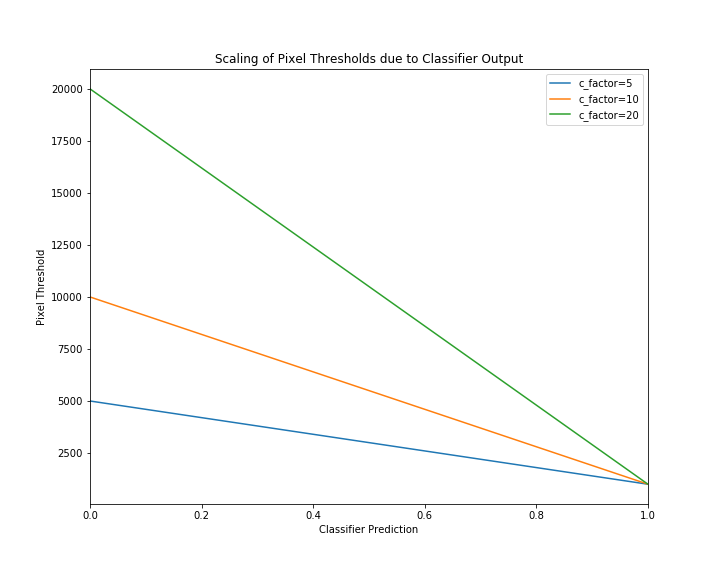
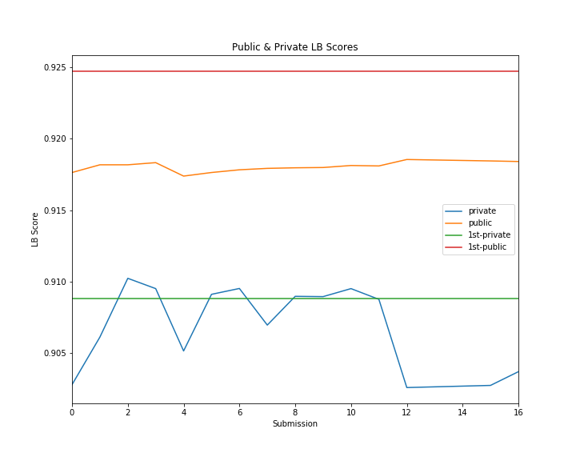

=========================================================================================================
`Severstal: Steel Defect Detection <https://www.kaggle.com/c/severstal-steel-defect-detection/overview>`_
=========================================================================================================

*Severstal is leading the charge in efficient steel mining and production. The company recently
created the country’s largest industrial data lake, with petabytes of data that were previously
discarded. Severstal is now looking to machine learning to improve automation, increase efficiency,
and maintain high quality in their production.*

*In this competition, you’ll help engineers improve the algorithm by localizing and classifying
surface defects on a steel sheet.*

.. contents::
   :depth: 3

Competition Report
==================

Results
-------
Winning submission:

+-----------+-------------+
| Public LB |  Private LB |
+-----------+-------------+
|  0.92124  | **0.90883** |
+-----------+-------------+

My best submission:

+-----------+-------------+
| Public LB |  Private LB |
+-----------+-------------+
|  0.91817  | **0.91023** |
+-----------+-------------+

My chosen submission:

+-----------+------------+
| Public LB | Private LB |
+-----------+------------+
|  0.91844  |   0.90274  |
+-----------+------------+

I chose my submission according to public LB score, and ended up rank 55/2436. Silly me!

Models
------
I used `segmentation_models.pytorch <https://github.com/qubvel/segmentation_models.pytorch>`_ (SMP)
as a framework for all of my models. It's a really nice package and easy to extend, so I implemented
a few of my own encoder and decoder modules.

I used an ensemble of models for my submissions, covered below.

Encoders
~~~~~~~~
I ported `EfficientNet <https://github.com/lukemelas/EfficientNet-PyTorch>`_ to the above framework
and had great results. I was hoping this would be a competitive advantage, but during the
competition someone added an EfficientNet encoder to SMP and many others started using it. I used
the `b5` model for most of the competition, and found the smaller models didn't work as well.

I also ported ``InceptionV4`` late in the competition and had pretty good results.

I ported a few others that didn't yield good results:

    - `Res2Net <https://github.com/gasvn/Res2Net>`_
    - `Dilated ResNet <https://github.com/wuhuikai/FastFCN/blob/master/encoding/dilated/resnet.py>`_

I had good results using ``se_resnext50_32x4d`` too. I found that because it didn't consume as much
memory as the ``efficientnet-b5``, I could use larger batch and image sizes which led to
improvements.

Decoders
~~~~~~~~
I used ``Unet`` + ``FPN`` from SMP. I added ``Dropout`` to the ``Unet`` implementation.

I implemented `Nested Unet <https://github.com/bigmb/Unet-Segmentation-Pytorch-Nest-of-Unets/blob/master/Models.py>`_
such that it could use pretrained encoders, but it didn't yield good results.

Other
~~~~~
I ported `DeepLabV3 <https://github.com/pytorch/vision/blob/master/torchvision/models/segmentation/deeplabv3.py>`_
to SMP but didn't get good results.

Scores
~~~~~~
These are the highest (private) scoring single models of each architecture.

+--------------------+---------+-----------+------------+
|       Encoder      | Decoder | Public LB | Private LB |
+====================+=========+===========+============+
|  efficientnet-b5   |    FPN  |  0.91631  |   0.90110  |
+--------------------+---------+-----------+------------+
|  efficientnet-b5   |   Unet  |  0.91665  |   0.89769  |
+--------------------+---------+-----------+------------+
| se_resnext50_32x4d |    FPN  |  0.91744  |   0.90038  |
+--------------------+---------+-----------+------------+
| se_resnext50_32x4d |   Unet  |  0.91685  |   0.89647  |
+--------------------+---------+-----------+------------+
|    inceptionv4     |    FPN  |  0.91667  |   0.89149  |
+--------------------+---------+-----------+------------+

Training
--------

GPU
~~~
Early on I used a 2080Ti at home. For the final stretch I rented some Tesla V100's in the cloud.
I found being able to increase the batch size using the V100 (16GB) gave a significant improvement
over the 2080Ti (11GB).

Loss
~~~~
I used ``(0.6 * BCE) + (0.4 * (1 - Dice))``. I applied smoothing (1e-6) to the labels.

Targets
~~~~~~~
I treated this as 4-class classification (no background class). If a pixel was predicted to have
two kinds of detects, the lower confidence predictions were removed in post-processing.

Optimizer
~~~~~~~~~
    - RAdam
    - Encoder
        - learning rate 7e-5
        - weight decay: 3e-5 (not applied to bias)
    - Decoders
        - learning rate 3e-3
        - weight decay: 3e-4 (not applied to bias)

LR Schedule
~~~~~~~~~~~
Flat for 30 epochs, then cosine anneal over 220 epochs. Typically I stopped training around 150-200
epochs.

Image Sizes
~~~~~~~~~~~
256x384, 256x416, 256x448, 256x480

Larger image sizes gave better results, but so did larger batch sizes. The ``se_resnext50_32x4d``
encoders could use a batch size of 32-36, while the ``efficientnet-b5`` encoders typically used a
batch size of 16-20.

Grayscale Input
~~~~~~~~~~~~~~~
The images were provided as 3-channel duplicated grayscale. I modified the models to accept 1
channel input, by recycling pretrained weights. I did a bunch of testing around this as I was
worried it might hurt convergence, but using 3-channel input didn't give better results.

I parameterised the recycling of the weights so I could train models using the R, G, or B pretrained
weights for the first conv layer. My hope was that this would produce a more diverse model ensemble.

Augmentation
~~~~~~~~~~~~
I used the following `Albumentations <https://github.com/albu/albumentations>`_:

.. code:: python

    Compose([
        OneOf([
            CropNonEmptyMaskIfExists(self.height, self.width),
            RandomCrop(self.height, self.width)
        ], p=1),
        OneOf([
            CLAHE(p=0.5),  # modified source to get this to work with grayscale
            GaussianBlur(3, p=0.3),
            IAASharpen(alpha=(0.2, 0.3), p=0.3),
        ], p=1),
        Flip(p=0.5),
        Normalize(mean=[0.3439], std=[0.0383]),
        ToTensor(),
    ])

I found the ``mean`` and ``std`` from the training images.

It would have been nice to experiment with more of these, but it took so long to train the models
it was difficult. I found these augs worked better than simple crops/flips and stuck with them.

Validation
~~~~~~~~~~
I used a random 20% of the training data for validation with each run.

Pseudo Labels
~~~~~~~~~~~~~
I used the ensemble outputs of models as pseudo labels, which gave a huge performance boost. I
used a custom `BatchSampler <https://github.com/khornlund/pytorch-balanced-sampler>`_ to undersample
(sample rate ~60%) from the pseudo-labelled data, and fix the number of pseudo-labelled samples per
batch (each batch would contain 12% pseudo-labelled samples).

Some other people had poor results with pseudo-labels. Perhaps the technique above helped mitigate
whatever downsides they faced.

`Apex Mixed Precision <https://github.com/NVIDIA/apex>`_
~~~~~~~~~~~~~~~~~~~~~~~~~~~~~~~~~~~~~~~~~~~~~~~~~~~~~~~~
I tried to get this to work for so long in order to take advantage of the larger batch sizes it
enables. However, now matter what I tried, I had worse convergence using it. Eventually I gave up.

It's possible I was doing something wrong - but I invested a lot of time into trying this, and from
talking to others at work it seems like they've had similar issues.

Post Processing & Submission
----------------------------

TTA
~~~
Only flip along dim 3 (W). I found TTA wasn't very useful in this competition, and consumed
valuable submission time.

Prediction Thresholds
~~~~~~~~~~~~~~~~~~~~~
I used 0.5 for each class ie. if the output was > 0.5, the output was positive for that defect.

I was worried that tweaking these would risk overfitting public LB.

Defect Pixel Thresholds
~~~~~~~~~~~~~~~~~~~~~~~
I used 600, 600, 1000, 2000. If an image had fewer than this number of defect pixels for a class,
all predictions for that class were set to zero.

I tested some different values but it actually didn't have much impact.

Component Domination
~~~~~~~~~~~~~~~~~~~~
Since my models were set up to predict 4 classes, I was using ``sigmoid`` rather than ``softmax``
on their outputs, which meant sometimes I got overlapping defect predictions. I had an idea to
look at the size of each component, and have the larger components "dominate" (remove) smaller
overlapping components. I got a tiny boost from this, but I think it may simply be because at that
stage I didn't have another way of ensuring there was only 1 defect prediction at each pixel.

I stopped using this technique in favour of simply taking the highest defect prediction for each
pixel.

Dilation
~~~~~~~~
I tried varying amounts of dilation. Sometimes I got a small improvement, and sometimes got worse
results so I stopped using it.

Ensemble Averaging
~~~~~~~~~~~~~~~~~~
*Here is where I made the mistake that cost me 1st place.*

I had been using mean averaging (eg. train 5 models, take the mean prediction for each class for
each pixel), and was struggling to break into the gold medal bracket. On the
last day, I was reading the discussion forums and started comparing the defect distributions of my
output with what others had probed to be the true defect distribution.

It looked like my models were overly conservative, as the number of defects I was detecting was
lower than other people and much lower than the probed LB distribution. So, I started thinking about
how I could increase the number of defect predictions. I had done some experimentation with
pixel thresholds, and found that changing them didn't have much of an effect. I knew that the score
was very sensitive to the prediction thresholds, so I was worried about fiddling with that and
potentially overfitting to the public LB. Then, I had an idea:

I'd noticed that sometimes I would add new, high-performing models to my ensemble, and my LB score
would decrease. I wondered if this might be explained by a majority of models *mean averaging* out
positive predictions too often. If we're detecting faults, maybe we should weight positive
predictions more than negative ones? I decided to try *Root Mean Square* averaging, as this would
hug the higher values. For example:

.. code::

    input: [0.2 0.3 0.7]
    Mean:  0.40
    RMS:   0.45

    input: [0.1 0.2 0.9]
    Mean:  0.40
    RMS:   0.54

    input: [0.4 0.5 0.6]
    Mean:  0.50
    RMS:   0.51

    input: [0.3 0.3 0.8]
    Mean:  0.47
    RMS:   0.52

    input: [0.1 0.8 0.8]
    Mean:  0.57
    RMS:   0.66

This looks good. If one model prediction is a ``9``, and the others are ``1`` and ``2``, shouldn't
we consider that a defect? (No, no we shouldn't. I was wrong.)

But when I tried it, I got a significant improvement on the LB! I went from ``0.91809`` to
``0.91854``, which was my best (public) score yet. Unknown to me, my private LB score had just
dropped from ``0.90876`` (winning score) to ``0.90259`` (rank 55).

I'm pretty new to Kaggle, and while I'd heard about leaderboard "shakeup", I didn't know it could
be this severe. I should have selected a 2nd submission from before I started using RMS to average
the results - and if I'd picked any of the recent submissions, I would have taken 1st place.

Classification Model
~~~~~~~~~~~~~~~~~~~~
Others on the discussion forums were advocating use of a two-step submission:

    1. Use a classifier to determine whether an image contains a each fault anywhere
    2. Ignore segmentation predictions for those ruled out by the classifier

The rationale was that false positives were very expensive, due to the way the Dice metric is
calculated. By doing this, you could reduce FP.

I was pretty skeptical of this approach, and thought it would only be useful early in the
competition while the precision of people's convolutional models was poor. But, as the competition
progressed and I was struggling to climb the LB, I thought I'd better give it a go.

Since I'd spent so long tuning my fully convolutional segmentation ensemble, I was worried about
allowing an "untuned" classifier to veto my segmentation predictions (and tuning it takes time).
I decided on a strategy to use the classification prediction to amplify the defect pixel
thresholds:

    1. When the classifier output is high (fault), we leave the pixel thresholds at their normal
       level.
    2. When the classifier output is low (no fault), we raise the pixel threshold by some factor.

The idea was that this would allow a false negative from the classifier to be overruled by a strong
segmentation prediction.

.. code:: python

    def compute_threshold(t0, c_factor, classification_output):
        """
        t0 : numeric
            The original pixel threshold
        c_factor : numeric
            The amount a negative classification output will scale the pixel threshold.
        classification_output : numeric
            The output from a classifier in [0, 1]
        """
        return (t0 * c_factor) - (t0 * (c_factor - 1) * classification_output)

Here's an example illustrating how the threshold is scaled with different factors. I tried values
5, 10, and 20.

Here's a table comparing the results of my submissions with a classifier, to my previous ones. Note
I ran it twice with ``c_factor = 5`` and changed some weights in my ensemble.

+---------------+-----------+------------+
|     Config    | Public LB | Private LB |
+===============+===========+============+
| No classifier |  0.91817  |   0.90612  |
+---------------+-----------+------------+
| c_factor = 5  |  0.91817  |   0.91023  |
+---------------+-----------+------------+
| c_factor = 5  |  0.91832  |   0.90951  |
+---------------+-----------+------------+
| c_factor = 10 |  0.91782  |   0.90952  |
+---------------+-----------+------------+
| c_factor = 20 |  0.91763  |   0.90911  |
+---------------+-----------+------------+

From looking at my public LB score, I got zero and tiny improvements using a classifier and
``c_factor=5``. When I tried increasing it, it looked like the results got much worse. Unknown to me,
this was actually taking my private LB score from rank 11 to significantly better than rank 1! The
first result, where my public LB score didn't increase at all, was actually the highest scoring
submission I made all competition. As far as I know, no one on the discussion board has reported
scoring this high on any of their submissions.

I gave up on using a classifier after this, and for the rest of my submissions I used only
fully convolutional models. I managed to get similar Private LB scores with a fully convolutional
ensemble, but using a classifier may have improved this further. Kaggle has disabled submissions
while the efficiency prize is running, so I won't be able to test this.

Final Ensemble
~~~~~~~~~~~~~~
I used the following fully convolutional ensemble for my final submissions:

- Unet
    - 2x se_resnext50_32x4d
    - 1x efficientnet-b5
- FPN
    - 3x se_resnext50_32x4d
    - 1x efficientnet-b5
    - 1x inceptionv4

+---------------------+-----------+----------------+
| Averaging Technique | Public LB |   Private LB   |
+=====================+===========+================+
|        RMS          |  0.91844  |     0.90274    |
+---------------------+-----------+----------------+
|       Mean^         |  0.91699  |   **0.90975**  |
+---------------------+-----------+----------------+

^I re-ran my final submission with mean-averaging after the deadline to check its performance.

Submission Scores
~~~~~~~~~~~~~~~~~
Visualisation of scores in the final week of the competition:

The dip at the end is when I started using RMS averaging.

Submission Kernels
------------------
Here are some public kernels showing the scores. There's a lot of copy-pasted code because of
the kernel requirement of this competition - no easy way around it!

1. `Private LB 0.91023 | Classification + Segmentation Ensemble  <https://www.kaggle.com/khornlund/sever-ensemble-classification?scriptVersionId=22207424>`_
2. `Private LB 0.90975 | Fully Convolutional Segmentation Ensemble <https://www.kaggle.com/khornlund/fork-of-sever-ensemble-3?scriptVersionId=22527620>`_

Discussion
----------

Improvements
~~~~~~~~~~~~
Next time I would like to:

- Softmax w/ background class
- Lovasz Loss
- Inplace BatchNorm (potentially huge memory saving)

And of course, *manually choose two submissions that are appropriately diverse*.

Questions
~~~~~~~~~
From looking at other people's solutions, I haven't seen anyone else mention label smoothing. I
found this gave a significant improvement - have others tried it?

Usage
=====

Folder Structure
----------------

::

  severstal-steel-defect-detection/
  │
  ├── sever/
  │    │
  │    ├── cli.py - command line interface
  │    ├── main.py - top level entry point to start training
  │    │
  │    ├── base/ - abstract base classes
  │    │   ├── base_model.py - abstract base class for models
  │    │   └── base_trainer.py - abstract base class for trainers
  │    │
  │    ├── data_loader/ - anything about data loading goes here
  │    │   ├── augmentation.py
  │    │   ├── data_loaders.py
  │    │   ├── datasets.py
  │    │   ├── process.py - pre/post processing, RLE conversion, etc
  │    │   └── sampling.py - class balanced sampling, used for pseudo labels
  │    │
  │    ├── model/ - anything to do with nn.Modules, metrics, learning rates, etc
  │    │   ├── loss.py
  │    │   ├── metric.py
  │    │   ├── model.py
  │    │   ├── optimizer.py
  │    │   └── scheduler.py
  │    │
  │    ├── trainer/ - training loop
  │    │   └── trainer.py
  │    │
  │    └── utils/
  │        .
  │
  ├── logging.yml - logging configuration
  ├── data/ - training data goes here
  ├── experiments/ - configuration files for training
  ├── saved/ - checkpoints, logging, and tensorboard records will be saved here
  └── tests/

Environment
-----------
Create and activate the ``Anaconda`` environment using:

.. code-block:: bash

  $ conda env create --file environment.yml
  $ conda activate sever

Note that the models used here are in a mirror/fork of
`SMP <https://github.com/khornlund/segmentation-models-pytorch>`_. If you want to use the same
models, you'll need to clone this and install it into the ``conda`` environment using

.. code-block:: bash

  $ git clone git@github.com:khornlund/segmentation-models-pytorch.git
  $ cd segmentation-models-pytorch/
  $ git checkout efficietnet
  $ pip install -e .

Note there are some slight differences between my EfficientNet implementation, and the one that is
now in SMP upstream. The key difference is I modified the encoders to support a configurable number
of input channels, so I could use 1 channel grayscale input.

Download
--------
You can download the data using ``download.sh``. Note this assumes you have your ``kaggle.json``
token set up to use the `Kaggle API <https://github.com/Kaggle/kaggle-api>`_.

Training
--------
Setup your desired configuration file, and point to it using:

.. code-block:: bash

  $ sever train -c experiments/config.yml

Upload Trained Model
--------------------
Checkpoints can be uploaded to Kaggle using:

.. code-block:: bash

  $ sever upload -r <path-to-saved-run> -e <epoch-num>

The checkpoint is inferred from the epoch number. You can select multiple epochs to upload, eg.

.. code-block:: bash

  $ sever upload -r saved/sever-unet-b5/1026-140000 -e 123 -e 234

Tensorboard Visualization
--------------------------
This project supports `<https://pytorch.org/docs/stable/tensorboard.html>`_ visualization.

1. Run training

    Set ``tensorboard`` option in config file true.

2. Open tensorboard server

    Type ``tensorboard --logdir saved/`` at the project root, then server will open at
    ``http://localhost:6006``

Acknowledgments
===============
This project uses the `Cookiecutter PyTorch <https://github.com/khornlund/cookiecutter-pytorch>`_
template.

Various code has been copied from Github or Kaggle. In general I put in the docstring where I
copied it from, but if I haven't referenced it properly I apologise. I know for a bunch of the loss  I
functions took code from `Catalyst <https://github.com/catalyst-team/catalyst>`_.
